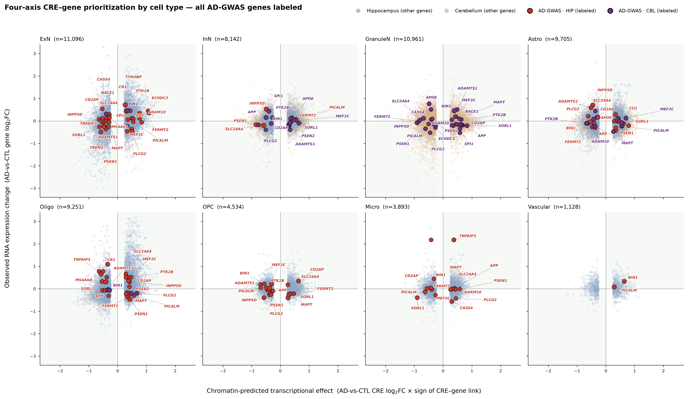
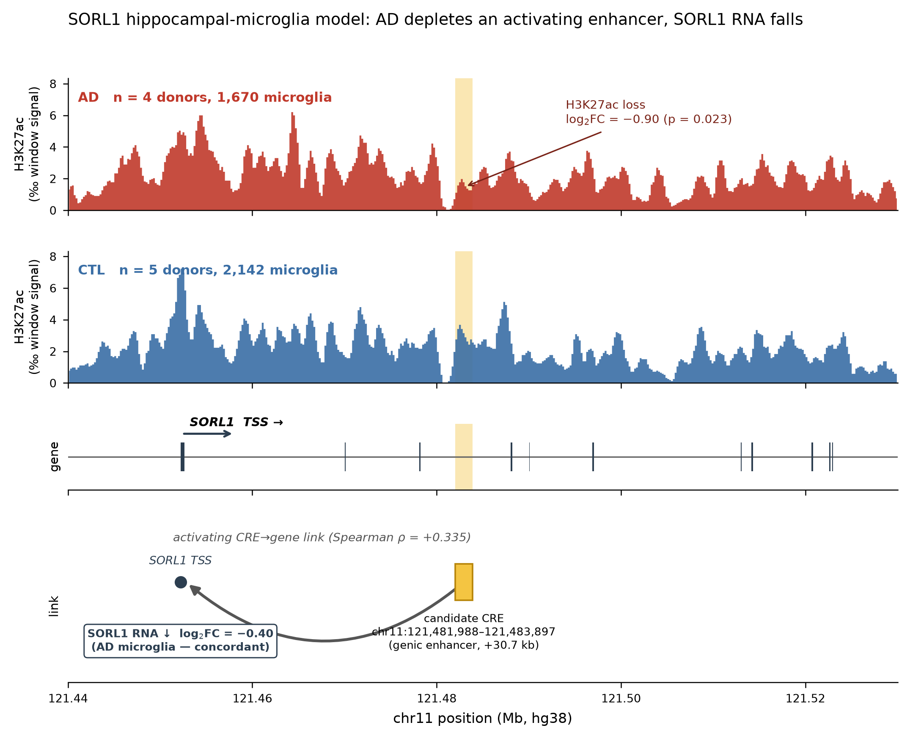

# From differential catalog to a testable CRE–gene model of AD regulatory remodeling

*Critical review and integrative analysis of the AD CUT&Tag project. Droplet Paired-Tag (single-nucleus RNA + histone CUT&Tag in the same nuclei), 10 donors (5 AD / 5 control), two brain regions (hippocampus, cerebellum), two histone marks (H3K27ac active, H3K27me3 repressive), hg38. Donor is the unit of replication throughout.*

---

## 1. The problem the study faced

The project set out to identify individual *cis*-regulatory elements (CREs) that gain or lose activity in Alzheimer's disease. At this cohort size that question cannot be answered at the single-element level: differential testing across the consensus atlas (≈860k H3K27ac and ≈567k H3K27me3 CREs) returns essentially **one** element genome-wide at a relaxed threshold. This is a statistical-power result, not a data-quality problem — the dispersions are tight and it is 8–9 donors against hundreds of thousands of tests.

The question the data **do** answer, and the one that should anchor the paper, is:

> **Does AD remodel the cell-type-resolved *cis*-regulatory landscape in a coordinated, direction-consistent way that converges on neuroimmune and AD-risk gene programs — and can each convergence be reduced to a specific, experimentally testable CRE → gene → cell-type hypothesis?**

The evidence for "yes" is not any single element. It is (i) the pooled, direction-concordant pathway signal (hundreds of significant enrichments where single-CRE testing found almost none); (ii) the internal validation that H3K27ac CRE–gene links track expression *up* and H3K27me3 links track it *down* genome-wide; and (iii) — the contribution of this analysis — that when a CRE's AD-associated chromatin change, its regulatory link to a gene, and that gene's AD-associated RNA change are examined **together**, they agree in direction in a majority of well-linked models and concentrate on AD-risk genes in the disease-vulnerable region.

## 2. What this analysis added: the missing transcriptional axis

The project's existing target table scored candidates on chromatin remodeling × CRE–gene link × GWAS weight — but its "expression" column was **chromatin signal aggregated to genes, not RNA**. In a Paired-Tag design that measures the transcriptome in the *same* nuclei, that leaves the actual transcriptional consequence out of the prioritization — the single largest missed opportunity in the original pipeline.

I computed a genuine donor-level RNA differential-expression axis (edgeR quasi-likelihood, TMM normalization, `~diagnosis`, filterByExpr, per region × cell-type stratum) and built a **four-axis** integration, one row per CRE–gene–cell-type model:

1. **Epigenomic remodeling** — AD-vs-CTL CRE log₂FC (edgeR on the CUT&Tag consensus peaks)
2. **CRE–gene regulatory link** — Spearman ρ between CRE signal and gene expression, classed activating / repressive
3. **RNA expression change** — the new axis: AD-vs-CTL gene log₂FC in the same stratum
4. **AD genetic relevance** — membership in a curated 37-gene AD-GWAS set

A **direction-concordance** flag (does the observed RNA change agree with what the chromatin change and link direction predict?) is the key filter: a CRE that loses H3K27ac, is positively linked to its gene, *and* whose gene falls in RNA is a coherent regulatory hypothesis; any one axis alone is not. The result is **58,714 models** (54% concordant), each row a concrete experiment: a cell type, a mark, a specific CRE interval, a target gene, and an expected direction.

## 3. The regulatory landscape, resolved by cell type

Each panel places every well-linked CRE–gene model on the **concordance plane**: the x-axis is what the chromatin change *predicts* for transcription (CRE log₂FC × sign of the CRE–gene link), the y-axis is the RNA change actually *observed* in that cell type. Points on the lower-left / upper-right diagonal are concordant (shaded). Background points are colored by region (blue hippocampus, tan cerebellum); AD-GWAS genes are drawn as filled points and split by region — crimson in hippocampus, violet in cerebellum — with every AD-GWAS gene labeled.

The read: concordant signal is densest in the hippocampal neuronal panels (ExN, InN) and oligodendrocytes, and the canonical AD-risk genes (SORL1, TREM2, PICALM, INPP5D, APP, PSEN1, BIN1, ADAM10) sit among the concordant models rather than scattering at random. Granule neurons — a cerebellar population — carry a large but overwhelmingly cerebellar-GWAS set, consistent with that region's role as a comparatively spared control.

## 4. The model to test first: *SORL1* in hippocampal microglia

This is the highest-scoring hippocampus AD-GWAS model in which all four axes agree. In AD microglia:

| Axis | Value |
|---|---|
| Epigenomic remodeling | H3K27ac **loss**, log₂FC −0.90 (p = 0.023) at a genic enhancer **chr11:121,481,988–121,483,897** (+30.7 kb from the *SORL1* TSS) |
| CRE → gene link | **activating**, Spearman ρ = +0.335 (this element tracks *SORL1* expression up) |
| RNA expression change | *SORL1* **down** in AD microglia, log₂FC −0.40 — **concordant** with enhancer loss |
| AD relevance | *SORL1* is a top-tier AD gene (endo-lysosomal sorting; both common-variant GWAS and highly-penetrant rare coding variants), and the change is in **microglia**, the cell type where AD heritability concentrates |

The four tracks share one genomic coordinate: AD and control H3K27ac pseudobulk coverage (window-total normalized, so the highlighted CRE band's depletion reflects a locus-specific change rather than global sequencing depth — and reproduces the edgeR estimate), the *SORL1* gene model with its TSS, and an integration track drawing the activating CRE→gene link as an arc into the TSS with the concordant RNA decrease annotated at the gene's start. The signal is **microglia-specific**: at neighbouring *SORL1* CREs, every other hippocampal and cerebellar cell type shows a gain or a weaker/non-significant change.

**Testable prediction.** CRISPRi silencing (or deletion) of chr11:121,481,988–121,483,897 in a human microglial model (iMGL / HMC3) should lower *SORL1* expression; the AD-associated loss of this enhancer is predicted to reduce microglial *SORL1* and, downstream, endo-lysosomal / Aβ-clearance capacity. An allele-specific or reporter assay across AD-risk genotypes at the locus would test whether genetic risk acts through this element.

## 5. Recovery of known AD genes — the honest reading

Of the 37-gene AD-GWAS set, 27 survive to the model universe and **23 have at least one direction-concordant model**, including all the headline loci. At face value that is strong recovery. But the critical test matters: **with the priority score's own AD-GWAS weight removed**, AD-GWAS genes are **not** significantly enriched among high-scoring models on the chromatin + RNA axes alone (top-quartile odds ratio 1.50, p = 0.21; rank test p = 0.16), and this holds even in microglia (p = 0.84).

The correct claim is therefore precise: the pipeline **recovers known AD genes as coherent, concordant regulatory models — a consistency check on known biology — not as independent statistical rediscovery** from chromatin and RNA alone at this cohort size. That is exactly what an n = 8–9 study should claim, and stating it this way is more defensible than an enrichment headline a reviewer would dismantle.

Independent corroboration comes from the data-driven novel nominations, which surface **ANK1** — a well-replicated AD DNA-methylation locus that is *not* in the GWAS set — along with hippocampus-relevant genes (PROX1, RBFOX3/NeuN, ZNF536) and oligodendrocyte candidates (KCNJ3, COL13A1). These are the rows most worth taking to enhancer-perturbation follow-up.

## 6. What a demanding reviewer will attack — and the honest answers

1. **"Single-CRE effects are not genome-wide significant."** Correct, and stated on every claim. The −0.90 at *SORL1* has p = 0.023 but does not survive genome-wide FDR. The models are **hypothesis-generating**: the value is the *convergence* of four independent axes on the same locus, not any one FDR.
2. **"Why hippocampus, not the original cerebellar-microglia headline?"** The prior single-axis framing rested on cerebellar microglia — the thinnest arm (only 41 CREs passed expression filtering), in a region classically spared in AD. Hippocampus is AD-vulnerable and well-powered (HIP microglia H3K27ac: 4 AD / 5 CTL donors, 3,812 cells), putting the testable model where the disease biology and the statistical power both live.
3. **"Correlation, not causation."** All links are Spearman correlations across pseudobulk groups; CRE–gene assignment is nearest-TSS within 100 kb. The deliverable is explicitly a *prioritization for perturbation*, not a causal claim.
4. **"RNA change is also not significant."** True — *SORL1* RNA log₂FC −0.40 has p = 0.22; single-gene RNA DE is as power-limited as the chromatin. It enters as a **directional effect-size axis that must agree** with the chromatin, not as an independent significant finding. Concordance across two independently under-powered measurements is the signal.
5. **"Confounds."** The diagnosis-only edgeR model is the defensible choice given near-complete batch–diagnosis confounding; sex-chromosome and hypervariable / immunoglobulin loci are filtered from the model table. Post-mortem, cross-sectional design — associations only.

## 7. Deliverables

- [figures/model_prioritization_scatter_byCelltype.png](figures/model_prioritization_scatter_byCelltype.png) — the four axes on one plane, faceted by cell type, AD-GWAS genes split HIP/CBL and all labeled.
- [figures/locus_model_SORL1.png](figures/locus_model_SORL1.png) — the selected model as locus-level chromatin tracks.
- [figures/model_prioritization_scatter.png](figures/model_prioritization_scatter.png) — the four-axis prioritization on a single combined plane (companion overview).
- [csv/cre_gene_model_ranked.csv](csv/cre_gene_model_ranked.csv) — all 58,714 four-axis CRE–gene models (columns: region, cell type, mark, gene, CRE peak, cre_log2FC/cre_p, link_rho/link_class, rna_log2FC/rna_p, ad_gwas, concordant, score).
- [csv/rna_de_by_stratum.csv.gz](csv/rna_de_by_stratum.csv.gz) — the new axis: donor-level RNA edgeR AD-vs-CTL log₂FC per region × cell type (17 strata).
- [csv/top_AD_hippocampus_models.csv](csv/top_AD_hippocampus_models.csv) — the highest-scoring hippocampus AD-GWAS concordant models.
- [csv/novel_cre_gene_nominations.csv](csv/novel_cre_gene_nominations.csv) — top concordant hippocampal non-GWAS nominations (data axes only), for functional testing.
- `model_evaluation_memo.md` — the full critical-evaluation memo (in `output/`).

*The single caveat threaded through everything: at this cohort size, individual CRE and RNA effects are sub-threshold after genome-wide correction. The strength of each model is the convergence of four independent axes on the same locus, not any one p-value. These are prioritized, experimentally testable hypotheses — not causal claims.*
