# Single-cell epigenomic remodeling of cis-regulatory elements in Alzheimer's disease

**Droplet Paired-Tag (single-nucleus RNA + histone CUT&Tag) of hippocampus and cerebellum from 10 post-mortem donors, profiling active (H3K27ac) and repressive (H3K27me3) chromatin**

*Computational analysis report. All 10 analysis steps complete. Author: Single-Cell Lead. Status: draft for review. Genome build: hg38.*

---

## Abstract

Alzheimer's disease (AD) risk is concentrated in the non-coding genome and, in particular, in microglial/myeloid regulatory elements, yet how the active and repressive cis-regulatory element (CRE) landscape is remodeled across brain cell types in disease remains incompletely mapped. Using Droplet Paired-Tag to profile single-nucleus transcriptomes together with H3K27ac (active) and H3K27me3 (repressive) histone marks in the *same* nuclei, we assembled a consensus, cell-type-resolved CRE atlas (859,854 H3K27ac and 567,404 H3K27me3 elements) from hippocampus (HIP, AD-vulnerable) and cerebellum (CBL, relatively spared) in 5 AD and 5 control donors. Testing AD versus control with donor-level pseudobulk (the statistically defensible unit of replication), single-element differences were essentially null at this cohort size — one element genome-wide — but pooled, pathway-level analysis revealed coordinated, cell-type- and region-specific enhancer remodeling (431 significant enrichments). The signal converges on neuroimmune regulation and, critically, is **state-resolved within glia**: a combined marker- and reference-based subtyping of hippocampal astrocytes and microglia (using published SEA-AD/ROSMAP disease-associated signatures) shows that AD inflammatory-enhancer activity is carried specifically by the *reactive* astrocyte and *activated* microglial states — homeostatic astrocytes lose H3K27ac at TNF-α/NF-κB, IL-1 and IL-6 programs while reactive astrocytes gain it, and homeostatic microglia lose the repressive H3K27me3 mark at immune loci (a de-repression/priming signature). By contrast, cerebellar microglia show broad reduction of H3K27ac at immune/inflammatory enhancers (Interferon-γ, the TYROBP/DAP12 microglial network, complement), which we frame cautiously as region-specific dampening. Reactive-state astrocyte proportions trend upward in AD, and metallothionein-stressed astrocytes are significantly expanded (p=0.03), though single-state proportion shifts are otherwise underpowered at n=9. CRE–gene correlation recovered the expected activating (H3K27ac) and repressive (H3K27me3) directional signatures and linked these changes to AD-GWAS loci (TREM2, TYROBP, INPP5D, PLCG2, APOE, CD33, IL6, CASS4). We provide prioritized, per-cell-type CRE–gene validation targets. Findings at this cohort size are hypothesis-generating and require independent replication.

## 1. Introduction

The genetic architecture of late-onset AD is dominated by common non-coding risk variants, which are strongly enriched in the enhancers of microglia and other myeloid cells rather than in neuronal regulatory elements ([Nott 2019]; [Novikova 2021]). This points to gene-regulatory dysfunction — the switching on and off of *cis*-regulatory elements — as a mechanistic layer between genetic risk and disease. Single-nucleus transcriptomics has catalogued cell-type-specific expression changes in AD cortex ([Mathys 2019]; [Mathys 2023]), and disease-associated microglial and astrocytic states have been defined ([Deczkowska 2018]; [Podleśny-Drabiniok 2020]), but the *chromatin* changes that underlie these transcriptional shifts — and how the active and repressive marks are jointly reconfigured — are less well resolved, particularly across regions of differing vulnerability.

Droplet Paired-Tag measures a histone modification and the transcriptome in the same single nucleus ([Zhu 2021]; [Xie 2023]), allowing CRE state and gene expression to be linked within a cell type without cross-assay deconvolution. Here we apply it with two complementary marks — **H3K27ac**, which labels active promoters and enhancers, and **H3K27me3**, the Polycomb repressive mark — to two regions on opposite ends of the AD vulnerability spectrum: the hippocampus, an early and heavily affected site, and the cerebellum, classically considered relatively spared. We ask three questions: (i) what does the cell-type-resolved CRE landscape look like and how is each element's regulatory state classified; (ii) which CREs, cell types and pathways are differentially marked in AD; and (iii) how do these changes connect to gene expression and to known AD-risk loci, yielding testable targets.

## 2. Cohort, design, and data provenance

Ten donors (5 AD: Br5090, Br5106, Br5120, Br5196, Br5620; 5 CTL: Br2700, Br5417, Br5764, Br6492, Br8179) were each profiled in 2 regions × 2 marks — a 10 × 2 × 2 = 40-sample design delivered as 12 multiplexed libraries (3–4 donors each). **Donor is the unit of replication throughout**, in keeping with best practice for multi-subject single-cell differential analysis ([Crowell 2021]).

**Sample-labeling corrections.** A provided mislabeled-samples file flagged five wet-lab region errors. After decoding each against donor library membership and confirming with the project lead: Br5106's cerebellar libraries were reassigned to HIP; Br5090's HIP library-3 material was reassigned to CBL; and Br5196's cerebellar-H3K27me3 material (actually cortex) was dropped as out of scope. After correction the analyzable arms are HIP-H3K27ac n=9 (4 AD/5 CTL), HIP-H3K27me3 n=9 (4/5), CBL-H3K27ac n=9 (4/5), and **CBL-H3K27me3 n=8 (3 AD/5 CTL — the least-powered arm)**. Full decisions and rationale are logged in `DECISIONS.md` (#01–#02, #06b).

## 3. Methods

A full plain-language walkthrough with all software versions is provided in the companion `METHODS_plain_english.md`. The key parameters and settings are summarized here. All analysis was in R 4.5.3 unless noted; genome build hg38.

**Software versions.** Seurat 5.5.1 and Signac 1.17.1 ([Stuart 2021]) for single-cell/chromatin handling; Harmony 1.2 for batch integration ([Korsunsky 2019]); MACS2 2.2 peak calls (as delivered) ([Zhang 2008]); edgeR 4.x quasi-likelihood for differential testing ([Robinson 2010]); fgsea 1.34 for rank-based enrichment (fast implementation of the GSEA framework, [Subramanian 2005]); EnsDb.Hsapiens.v86 for gene models; htslib 1.23.1 (tabix/bgzip) for fragment indexing.

**QC and valid-cell selection.** From each library we retained only demultiplexed singlets (dropping multiplets and background droplets by the delivered assignment), then applied count thresholds nCount_RNA ≥ 500, nFeature_RNA ≥ 300, and nCount_peaks ≥ 300. A percent-mitochondrial filter was specified but **not applicable** — the delivered gene reference contains no mitochondrial genes (percent.mt therefore NA in every library). Region and mark are defined by folder provenance corrected for the mislabeled samples (§2). This yielded **147,228 QC-pass nuclei** across the 12 libraries.

**De-novo cell typing.** Clustering was done per region with both marks' nuclei together (they are the same nuclei in Paired-Tag): LogNormalize → 2,000 highly variable genes → ScaleData → PCA (30 PCs) → Harmony integration over library → shared-nearest-neighbor graph → Louvain clustering (resolution 0.6) → UMAP. Clusters were annotated by `AddModuleScore` on region-appropriate canonical marker panels (z-scored cluster means, argmax to subtype, collapsed to major type). HIP resolved 8 major types; CBL 9 (granule-neuron-dominated, ~75%). Both marks co-mingled within every cell type, confirming that Harmony removed antibody-technical variance rather than biology. The resulting per-nucleus table `csv/cell_annotations.csv.gz` (147,228 nuclei) is the authoritative key for all downstream pseudobulk aggregation, including the region correction.

**Authoritative CRE matrix.** The per-library MACS2 peak sets delivered with the data are not comparable across donors (only ~106 peaks shared between two example libraries). We therefore built, per mark, a **consensus peak set** by taking the union of all per-library MACS2 peaks and reducing (`GenomicRanges::reduce`) to non-overlapping intervals on standard chromosomes: **859,854 H3K27ac peaks** (median width 677 bp) and **567,404 H3K27me3 peaks** (median 2,022 bp). We then **re-quantified all 12 libraries' fragments** over the mark's consensus (Signac `FeatureMatrix`, QC-pass barcodes only), relabeled to globally unique cell IDs, and summed to **donor × cell-type × region pseudobulk** (152 H3K27ac / 144 H3K27me3 groups after the region-label correction). Peaks were annotated to genomic context (promoter −2 kb/+200 bp > genic > distal, priority order) and to the nearest protein-coding gene by strand-aware TSS distance.

**Differential CRE testing.** Per cell-type × region × mark stratum with ≥3 AD and ≥3 CTL donors and ≥25 cells per donor group (29 analyzable strata), we tested AD vs CTL with edgeR quasi-likelihood F-tests on the donor pseudobulk (TMM normalization, `filterByExpr`, design `~diagnosis`). **Batch (sequencing library) was deliberately excluded** as a covariate: it is near-confounded with diagnosis in this cohort (some library levels contain a single donor of one diagnosis), and including it both exhausts residual degrees of freedom and manufactures spurious "hits" (e.g. GSTM1, TMEM106B) that vanish under the diagnosis-only model. Significance thresholds: primary FDR < 0.05 and |log2FC| ≥ 0.5; relaxed FDR < 0.1 and |log2FC| ≥ 0.25.

**Pooled-power analyses.** After the near-null single-element result, and at the project lead's direction, we added two analyses that pool weak concordant signal: (i) **gene-level aggregation DE** — summing CREs to their nearest gene and re-testing in edgeR; and (ii) **rank-based GSEA** (fgsea, minSize 10, maxSize 500, nPermSimple 10,000) on genes ranked by signed −log10(p) × sign(log2FC), against Enrichr gene-set collections (GO Biological Process 2021, KEGG 2021 Human, MSigDB Hallmark 2020, WikiPathways 2019). Enrichr GMTs were used because org.Hs.eg.db/MSigDBr could not be installed in this environment; this is noted as a source-of-bias in §7.

**CRE–gene associations.** For each CRE with a nearest gene within 100 kb, we computed the Spearman correlation of CRE signal (log CPM) against that gene's expression (RNA pseudobulk, matched groups) across the 152/144 shared donor × cell-type groups, with BH FDR. Positive H3K27ac and negative H3K27me3 correlations were classed activating/repressive respectively.

**CRE regulatory-state classification.** We defined 616,374 unified loci by reducing the union of both marks' consensus peaks. Per common cell type, each locus was labeled from its mapped mean CPM (threshold 1 CPM): active = H3K27ac ≥ 1 & H3K27me3 < 1; repressed = the reverse; dual/transitional = both ≥ 1; unclear = both < 1. A global state was assigned as the dominant per-cell-type state, with the special case of active-in-some + repressed-in-other cell types → cell-type-switched. Because both marks modify the same residue (H3 Lys27) and cannot co-occur on one nucleosome, "dual" denotes population-level heterogeneity, **not** single-nucleosome bivalency (which would require H3K4 marks not assayed here).

**Glial subtype analysis (astrocytes & microglia).** HIP astrocytes and microglia (all 9 donors adequate) were subclustered (subset, NormalizeData, 2,000 HVG, PCA 20, Louvain resolution 0.3). States were assigned by combining **de-novo `FindAllMarkers`** (RNA assay, `only.pos`, min.pct 0.25, logfc 0.5) with **reference-based `AddModuleScore`** against published consortium disease-associated signatures (DAM, [Keren-Shaul 2017]; ROSMAP microglial states, [Sun 2023]; DAA, [Habib 2020]; plus SEA-AD MHC-II and homeostatic/metallothionein panels), taking the argmax reference score per subcluster with marker cross-check. Low-quality subclusters were flagged and excluded consistently in both cell types: mitochondrial-high (>6% mitochondrial-encoded reads, ~700 median genes/nucleus), oligodendrocyte- or neuron-doublet (co-expressing MBP/PLP1 or SYT1/RBFOX3), and lymphocyte-contamination (NKG7/CD3). Fine subclusters were collapsed to 2–3 states per cell type for statistical power. Composition shifts were tested per donor AD vs CTL (Wilcoxon, n=9). For state-resolved CRE remodeling, consensus H3K27ac and H3K27me3 peaks were re-quantified over donor × cell-type × state pseudobulks (Signac `FeatureMatrix`, corrected state assignments), and edgeR QL AD vs CTL was run per state × mark with a CPM-based expression filter (CPM ≥ 1 in ≥ 3 samples; the default `filterByExpr` fails on the small-library minority states) followed by pooled per-state rank-based GSEA on gene-aggregated signed −log₁₀P (fgsea, same settings as the cell-type-level analysis).

## 4. Results

Figures referenced below are the saved artifacts; each is listed with its filename in §9.

### 4.0 Quality control and cell typing
After valid-cell filtering, retained nuclei sit well above the QC floors in both modalities (RNA mode ~1.5–2k genes; CUT&Tag ~5–10k fragments), cleanly separated from the empty-droplet population (**Figure 1**). De-novo clustering recovered the expected major cell types in each region — hippocampus oligodendrocyte-rich (8 types), cerebellum granule-neuron-dominated (9 types) — with both histone marks co-mingling within each cell type after Harmony integration (**Figures 2–3**).

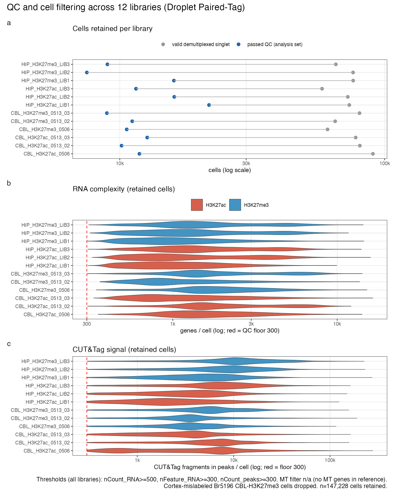
*Figure 1. Per-library QC: nuclei retained, RNA complexity, and CUT&Tag signal, with thresholds annotated.*

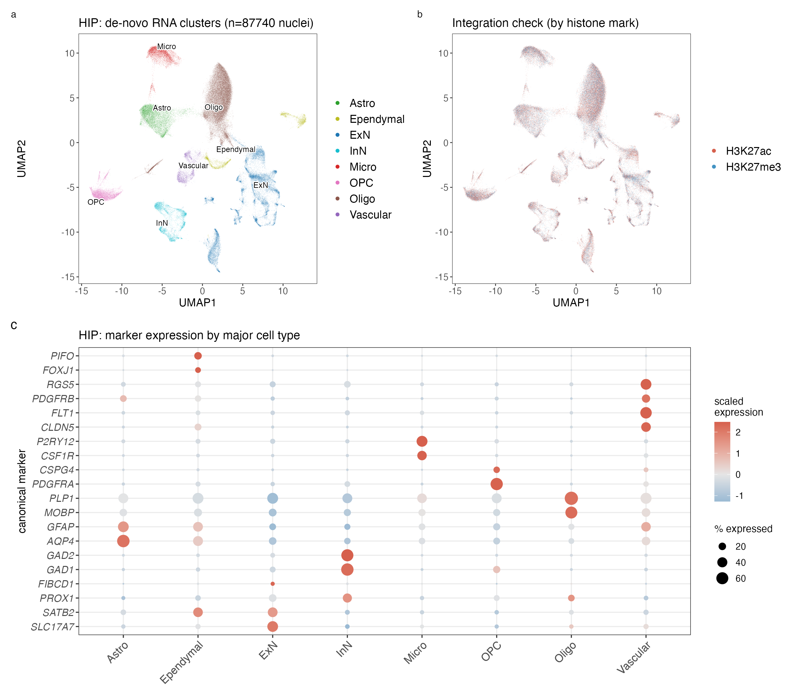
*Figure 2. Hippocampus — UMAP by major cell type, mark-integration check, and marker dotplot.*

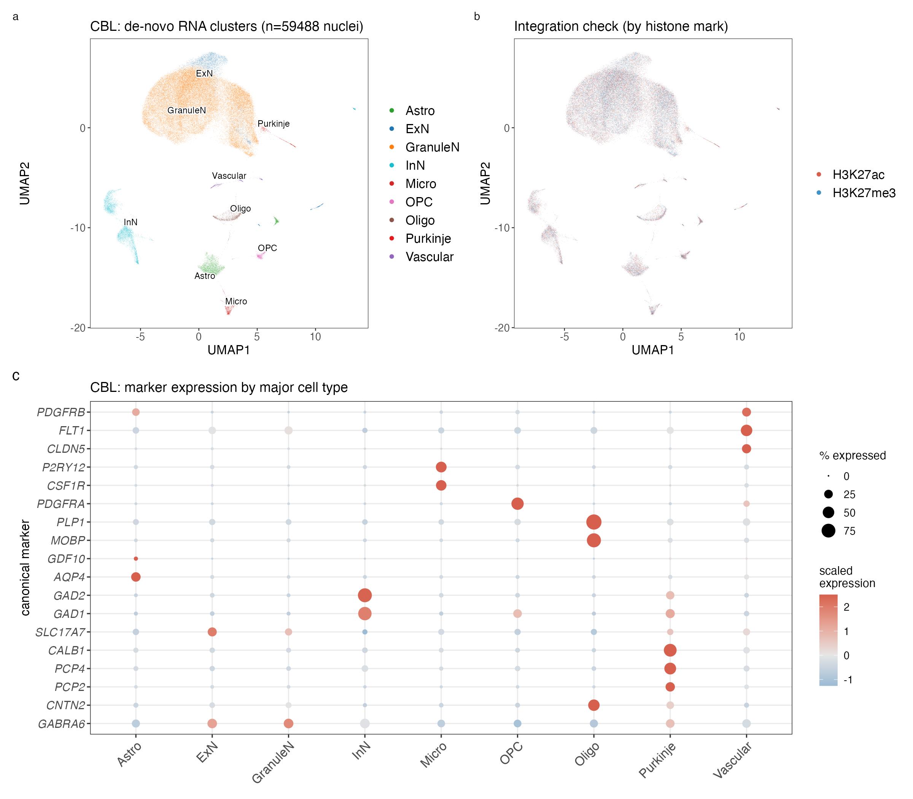
*Figure 3. Cerebellum — UMAP by major cell type (granule-neuron-dominated), mark-integration check, and markers.*

### 4.1 An annotated, cell-type-resolved CRE atlas (Deliverable 1)
The consensus atlas covers 859,854 H3K27ac and 567,404 H3K27me3 CREs, each annotated with genomic context (H3K27ac: 50.7% distal, 46.7% genic, 2.6% promoter — the distal/genic dominance expected of an enhancer-rich active mark) and nearest protein-coding gene, plus per-cell-type mean signal (**Figure 4**). H3K27me3 domains are broader (median 2,022 bp) than H3K27ac peaks (677 bp), as expected for a Polycomb domain mark. Clustering cell types by CRE profile is organized by both cell class and region: hippocampal glial/vascular types form one coherent block, and the top-level split groups the cerebellar types with hippocampal excitatory and inhibitory neurons — i.e. a neuronal-vs-non-neuronal axis crosses region at the very top, with region a strong secondary structure (**Figure 5**). There are no residual cross-region contamination singletons after the label-correction, so the neuron/CBL grouping reflects shared neuronal regulatory programs rather than mislabeling. AD-risk genes carry many nearby CREs (e.g. PICALM 75 H3K27ac / 29 H3K27me3; BIN1 53/26; MAPT 24/18), giving substrate for the downstream CRE–gene analysis.

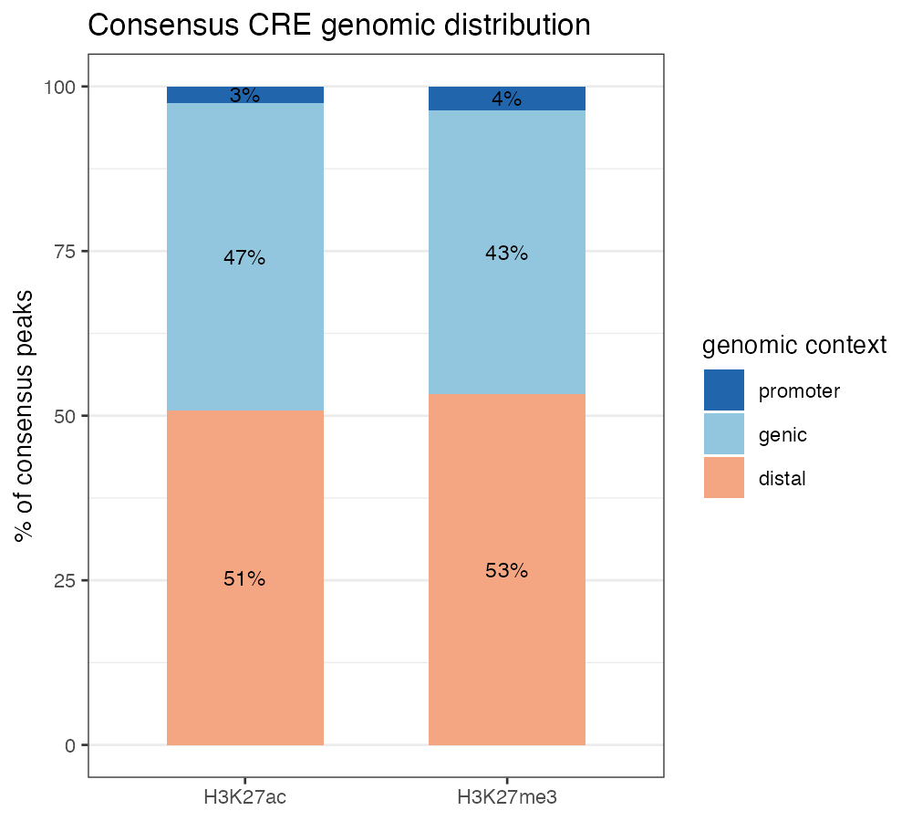
*Figure 4. Genomic-context composition of the consensus CRE atlas by mark (promoter/genic/distal).*

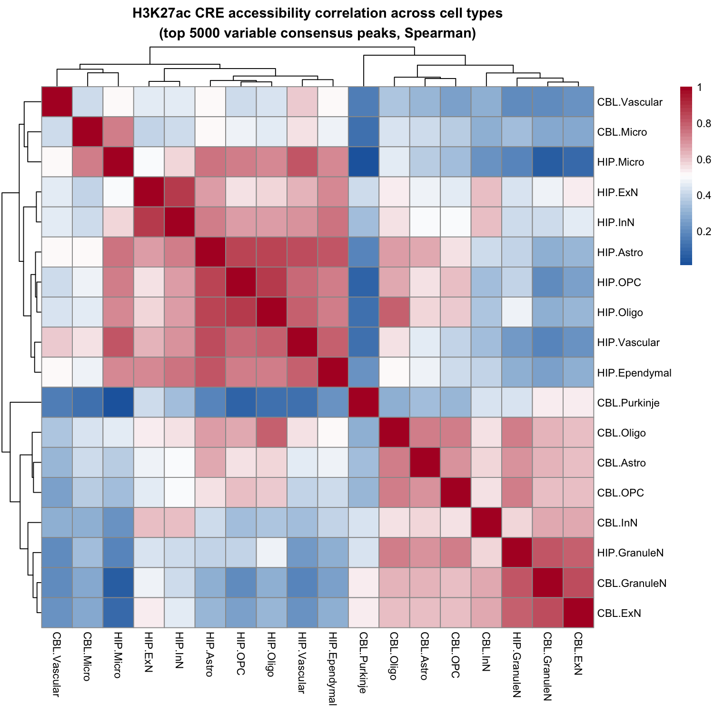
*Figure 5. H3K27ac CRE-profile similarity across cell types (top 5,000 variable peaks, Spearman); dendrogram shows a neuronal/non-neuronal split with strong region structure.*

### 4.2 CRE regulatory states (added per project-lead request)
H3K27ac and H3K27me3 modify the **same residue (H3 Lys27)** and are chemically mutually exclusive on a single nucleosome, so dual-signal CREs in pseudobulk reflect **population heterogeneity / transitional states, not single-nucleosome bivalency** (true bivalency requires H3K4 marks, not assayed here). Genome-wide, loci partitioned as unclear 36.8%, repressed 19.5%, dual 19.0%, cell-type-switched 13.6%, and active 11.0% (**Figure 6**). State properties are internally coherent: active CREs are promoter/genic-enriched, unclear CREs are narrow and distal, and dual CREs are the widest (broad H3K27me3 domains overlapping active peaks). Among AD-gene promoters, PICALM and PSEN1 are active; **APOE is cell-type-switched** — active in some cell types and repressed in others, matching its well-documented cell-type-specific regulation; BIN1, CLU, MAPT, TREM2, APP, SORL1 and ABCA7 are dual.

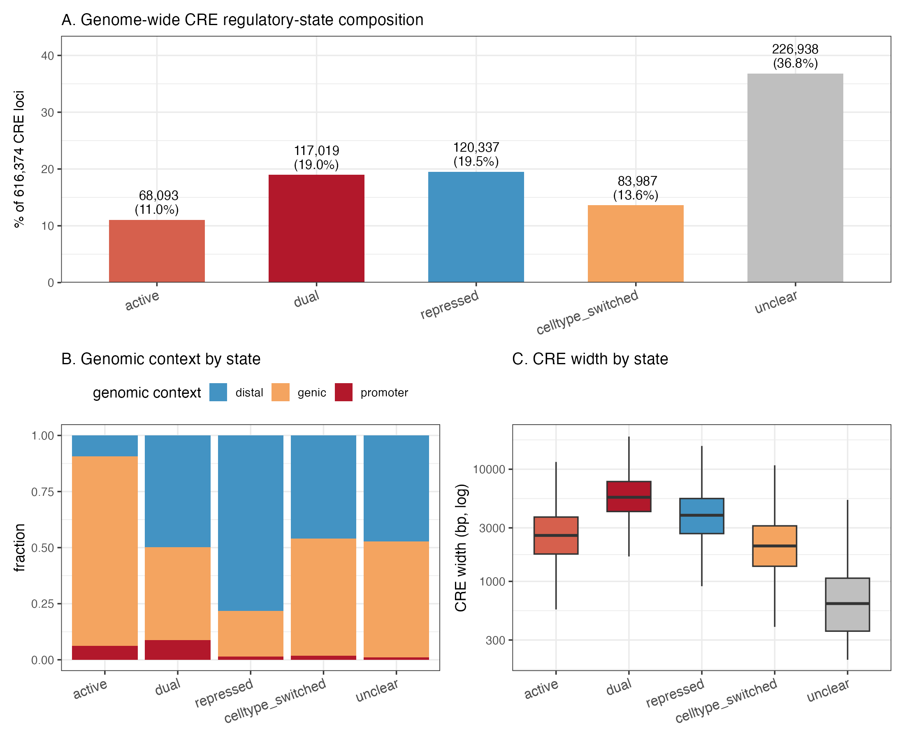
*Figure 6. Genome-wide CRE regulatory-state composition, genomic-context enrichment by state, and CRE width by state.*

### 4.3 Differential CRE: near-null at the single-element level (Deliverable 2)
At 8–9 donors per arm, **AD produces essentially no genome-wide single-CRE differential signal** (**Figure 7**): exactly one CRE passes even the relaxed threshold (a distal H3K27ac element near IMPAD1 in HIP inhibitory neurons, log2FC −1.38, FDR 0.02). This is a power limit, not a data-quality problem — per-stratum dispersions are tight (BCV 0.12–0.18) and the constraint is cohort size against hundreds of thousands of tests. A batch-adjusted model produced apparent hits (GSTM1, TMEM106B) that **disappear under the diagnosis-only model**, i.e. batch confounding masquerading as signal; these are not reported as findings.

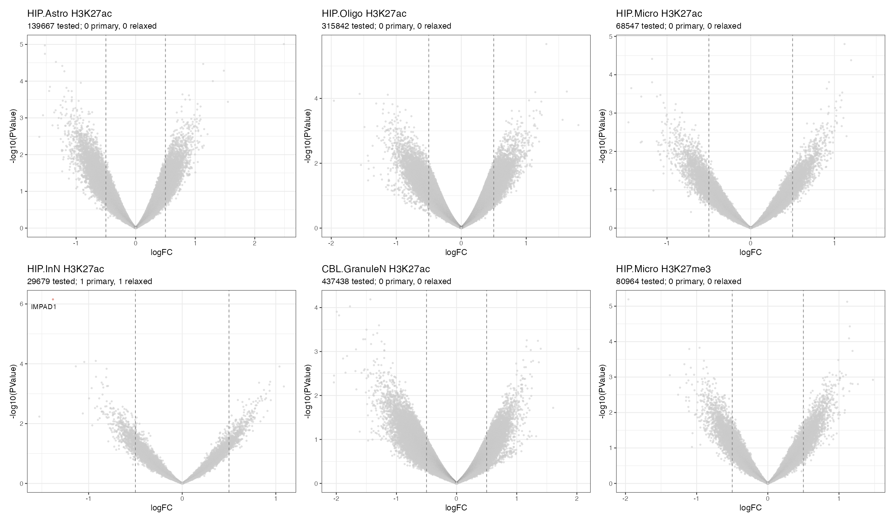
*Figure 7. AD-vs-CTL differential-CRE volcano plots per stratum (diagnosis-only model); the landscape is essentially null at the single-element level.*

### 4.4 Coordinated, cell-type-specific remodeling emerges under pooled analysis (Deliverables 2, 4)
Rank-based GSEA on gene-level rankings yields **431 significant pathway enrichments** where single-CRE testing found almost none (**Figure 8**), demonstrating that AD-associated remodeling is real but distributed as many small, concordant shifts rather than a few large ones. Remodeling burden concentrates in a handful of contexts: **CBL microglia H3K27ac (148 pathways) » HIP excitatory neurons (79) > HIP oligodendrocytes (69) > CBL granule-neuron H3K27me3 (32) ≈ CBL granule-neuron H3K27ac (29) > HIP astrocytes H3K27ac (28)** (**Figure 9**, panel A now carries the numeric count on each bar).

The biologically important structure, however, is not the *count* of enrichments but *which programs shift in which direction in each cell type*, and these differ sharply by cell type and region (**Figure 8**). Reading the per-group enrichments directly:

- **Cerebellar microglia (H3K27ac)** are dominated by coordinated **loss** of active marking at a tight immune module — IL-2/STAT5, TNF-α/NF-κB, the TYROBP/DAP12 causal network, interferon-γ response, and allograft-rejection/antigen programs — the single most coherent signature in the dataset.
- **Hippocampal astrocytes (H3K27ac)** show the opposite polarity on overlapping programs: **gain** of TNF-α/NF-κB, hypoxia, and cellular-response-to-starvation enhancer marking — a reactive-astrocyte inflammatory signature confined to the vulnerable region.
- **Hippocampal excitatory neurons and oligodendrocytes (H3K27ac)** enrich for RNA-processing/splicing and retinol/xenobiotic-metabolism programs alongside loss of olfactory/sensory and cytokine-receptor terms — a neuronal/oligodendroglial metabolic-and-immune remodeling distinct from the glial immune axis.
- **Cerebellar granule neurons (H3K27me3)** uniquely gain repressive marking at peptidyl-serine phosphorylation, B-cell proliferation and response-to-dsRNA programs.

Thus the dominant *theme* is immune/inflammatory, but its **direction is cell-type- and region-specific**: gained in hippocampal reactive astrocytes, lost in cerebellar microglia, and repressive-mark–gained in cerebellar neurons. The per-cell-type/region-specific enrichment map (**Figure 8**) is the evidence base for this reading; development, synaptic and metabolic programs form the secondary themes.

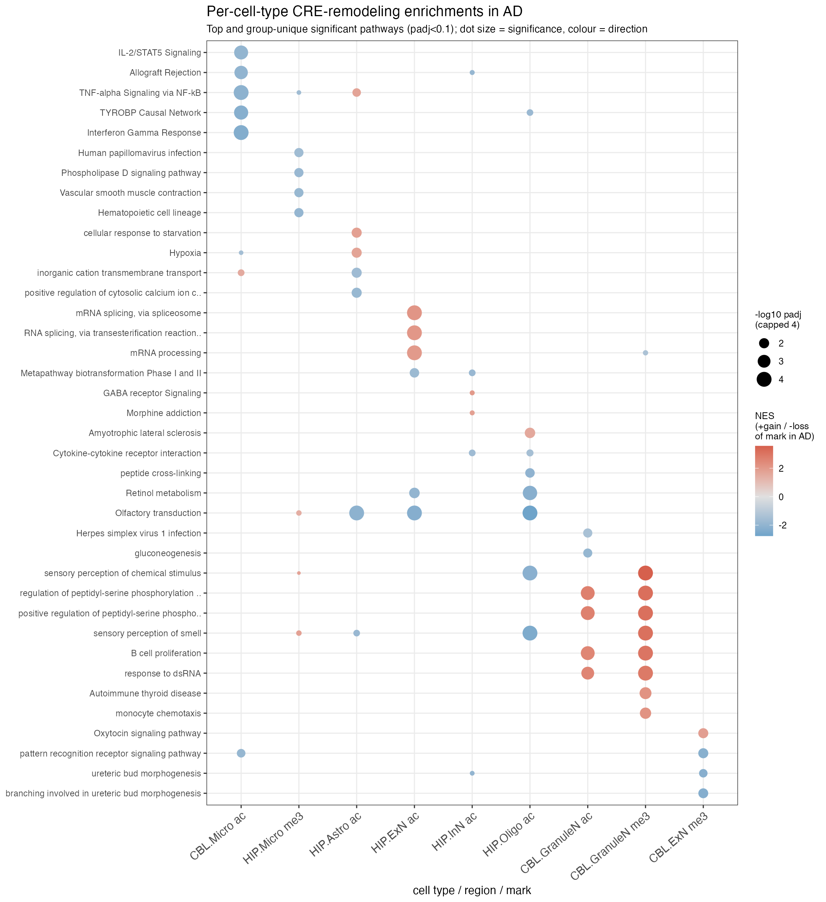
*Figure 8. Per-cell-type CRE-remodeling enrichments in AD. Columns are cell-type × region × mark groups, rows are pathway terms (top and group-unique significant terms per group, padj<0.1); dot size = −log10 padj, colour = NES sign (red = mark gained in AD, blue = lost). The polarity flip on immune programs between CBL microglia (blue/lost) and HIP astrocytes (red/gained) is the central per-cell-type contrast.*

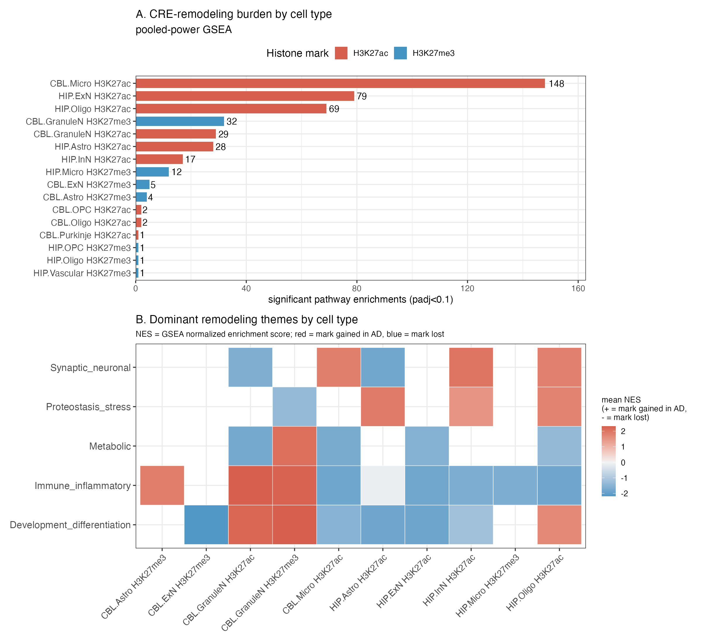
*Figure 9. (A) Remodeling burden per cell type × mark (bar = number of significant pathway enrichments, padj<0.1). (B) Dominant-theme × stratum direction map; colour = mean NES (positive = mark gained in AD, negative = lost). NES = GSEA normalized enrichment score.*

### 4.5 A region-divergent glial immune axis (Deliverable 5)
Examined by region and direction, the immune-enhancer signal is not one axis but a **region-divergent pair of opposite-polarity glial responses** on overlapping inflammatory programs:

- **Hippocampus (AD-vulnerable region).** HIP **astrocytes gain H3K27ac at TNF-α/NF-κB inflammatory machinery** — a reactive-astrocyte signature. The state-resolved analysis (§4.7) localizes this gain specifically to the reactive astrocyte state. Hippocampal excitatory neurons and oligodendrocytes carry additional H3K27ac remodeling of metabolic and immune programs. Because the hippocampus is affected early and severely in AD, these hippocampal changes are a primary AD-relevant axis.
- **Cerebellum.** CBL **microglia show broad reduction of H3K27ac at immune/inflammatory enhancers** — interferon-γ response, the TYROBP/DAP12 microglial network, TNF-α/NF-κB, complement, and cytokine production. We interpret this cautiously as region-specific immune **dampening, compensation, or impaired responsiveness** rather than silencing; it is cerebellum-specific and does not replicate in HIP microglia (which have no significant immune H3K27ac enrichment).

The key contrast is that the **same inflammatory programs are marked in opposite directions in the two regions' glia** — gained in hippocampal (reactive) astrocytes, lost in cerebellar microglia — rather than a uniform disease-wide immune activation. This region-and-cell-type divergence, and its resolution to specific glial states, is developed in §4.7.

**What "AD-GWAS genes in the leading edges" means.** GSEA's "leading edge" is the subset of genes within an enriched pathway that actually drive its enrichment score — i.e. the highest-ranked concordant genes, not the whole gene set. Collecting the leading-edge genes across all significant enrichments, **21 established AD-GWAS risk genes** are among them (TREM2, TYROBP, SPI1, INPP5D, PLCG2, CD33, APOE, CR1, PTK2B, ABCA7, CASS4, IL6, TNFAIP3, MEF2C, SORL1, APP, ADAM10, EPHA1, and others). In plain terms: the enhancer programs remodeled in AD are not enriched for arbitrary genes — they are specifically enriched for the genes that human genetics independently implicates in AD risk, which is the connection between our epigenomic signal and the disease's genetic architecture. Sex-chromosome and germline-CNV/hypervariable loci (USP17L, GSTM1/GSTT1, HLA, Ig/OR/LILR/KIR, UGT2B, C4, Y-genes) were filtered from target lists as post-mortem confounders.

### 4.6 CRE–gene associations validate the linkage (Deliverable 3)
Peak–RNA correlation across the matched pseudobulk recovers the expected directional signatures (**Figure 10**): **H3K27ac gives 163,756 activating links** (positive rho, median +0.14) versus only 3,054 negative, while **H3K27me3 gives 40,449 repressive links** (negative rho) versus 11,934 positive — active marking tracks expression up, repressive marking tracks it down, exactly as biology predicts. This is a strong internal check that the pipeline measures genuine regulation. AD genes behave coherently: APOE shows activating H3K27ac links (rho +0.26 to +0.45) *and* a significant repressive H3K27me3 promoter link (rho −0.28, FDR 7×10⁻³), consistent with its cell-type-switched state; APP shows repressive H3K27me3 links (rho −0.22 to −0.36).

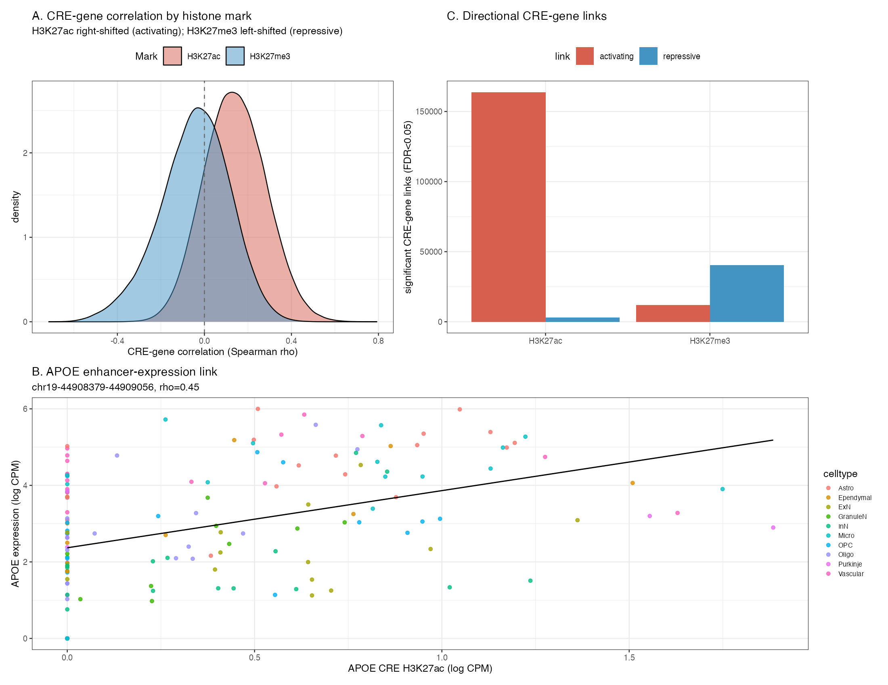
*Figure 10. CRE–gene correlation distributions by mark, an example APOE enhancer–expression scatter, and directional link counts.*

### 4.7 Astrocyte and microglial subtype states (reference + marker analysis)
To resolve *which cellular states* carry the glial immune signal, hippocampal astrocytes (9,479 nuclei) and microglia (6,557) were subclustered and each subcluster assigned a state by combining **de-novo marker discovery** with **reference-based scoring against published disease-associated signatures** (microglia: homeostatic P2RY12/CX3CR1/TMEM119, DAM/lipid-associated TREM2/APOE/SPP1/CST7/GPNMB, inflammatory IL1B/CCL2/CD83, interferon IFIT1/ISG15/MX1, antigen-presenting HLA-DRA/CD74, and perivascular macrophage MRC1/CD163; astrocytes: homeostatic/protoplasmic SLC1A2/GLUL/AQP4, reactive/DAA GFAP/VIM/SERPINA3/CHI3L1/C3, metallothionein-stress MT1G/MT2A). Signatures are drawn from the DAM ([Keren-Shaul 2017]), ROSMAP microglial-state ([Sun 2023]) and disease-associated-astrocyte ([Habib 2020]) frameworks; each assigned state scores highest on its matching reference signature (**Figures 11–12**, panel b). Low-quality mitochondrial-high subclusters (>6% mitochondrial-encoded reads, ~700 median genes) and oligodendrocyte/neuron-doublet and lymphocyte-contamination subclusters were identified and excluded consistently in both cell types. Microglia resolved **homeostatic (2,664 nuclei), inflammatory (226, CCL3/CCL4/TNFAIP3/CD83) and PVM/lipid-DAM (153, CD163/GPNMB/MRC1)** states; astrocytes resolved **homeostatic (4,442), reactive (881, CHI3L1/CXCL2/CCL2) and metallothionein-stress (997)** states.

**Composition shifts (Figure 13).** Per-donor state proportions were tested AD vs CTL (Wilcoxon, n=9). All reactive/activated states trend upward in AD and homeostatic states downward, as expected biologically, but most shifts are underpowered at this cohort size: astrocyte homeostatic 0.92→0.25 median (down in AD, p=0.11), reactive 0.08→0.35 (up, p=0.29); microglial homeostatic 0.95→0.92 (down, p=0.91) with inflammatory and PVM/lipid-DAM up but non-significant. The one significant shift is **expansion of metallothionein-stress astrocytes in AD (0.004→0.10 median, p=0.032)** — a metal-handling/oxidative-stress astrocyte state.

**State-resolved enhancer remodeling (Figure 14) is the key result.** Re-quantifying consensus CREs over donor × state pseudobulks and testing AD vs CTL shows that single-CRE differences remain near-null per state (one H3K27me3 CRE, and BCV rising from 0.17–0.18 in the large homeostatic states to 0.63 in the smallest state as power drops with splitting), but pooled per-state GSEA reveals a clean **astrocyte state-switch**: **homeostatic astrocytes lose H3K27ac** at inflammatory programs (TNF-α/NF-κB, IL-1β, IL-2, inflammatory response, chemotaxis; all NES<0) while **reactive astrocytes gain them** (TNF-α/NF-κB NES +1.63, IL-6 response +1.71, IL-1 +1.75, Fc-γ receptor, Oncostatin M). The reactive-astrocyte inflammatory-enhancer gain seen at the bulk cell-type level (§4.4–4.5) is therefore carried specifically by the reactive state, not spread evenly across astrocytes. In microglia, the **activated state gains** immune H3K27ac (TNF-α/NF-κB +1.56, IL-2/STAT5, IL-6), while **homeostatic microglia lose the repressive H3K27me3 mark** at immune loci (IFN-γ −1.73, TNF-α −1.70, IL-6/JAK/STAT3, IL-7) — a de-repression/priming signature at the chromatin level. The AD glial signal thus lives in **state-specific enhancer remodeling** — reactive-astrocyte activation and homeostatic-microglial de-repression — more than in gross subtype proportion shifts, consistent with the near-null single-CRE DE and the pooled pathway signal.

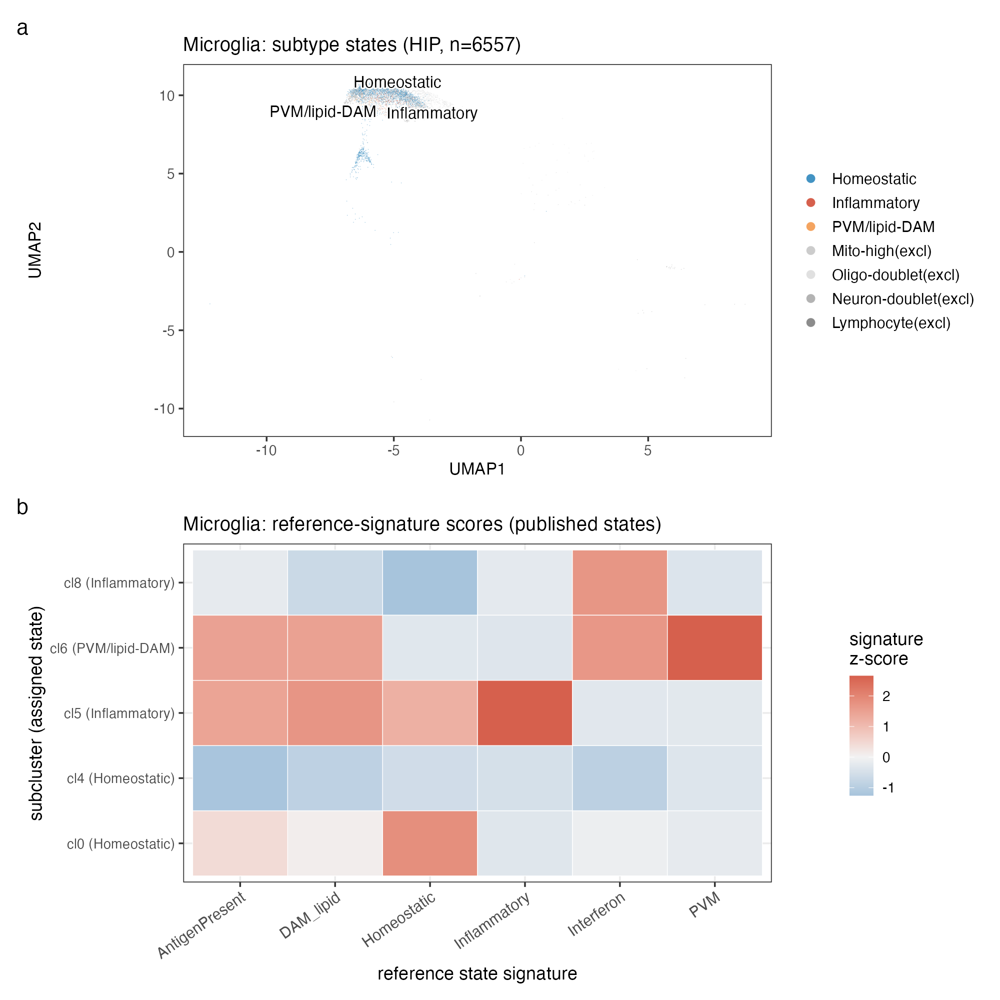
*Figure 11. HIP microglia — (a) subtype-state UMAP; (b) reference-signature z-scores per subcluster confirming state assignments against published microglial signatures.*

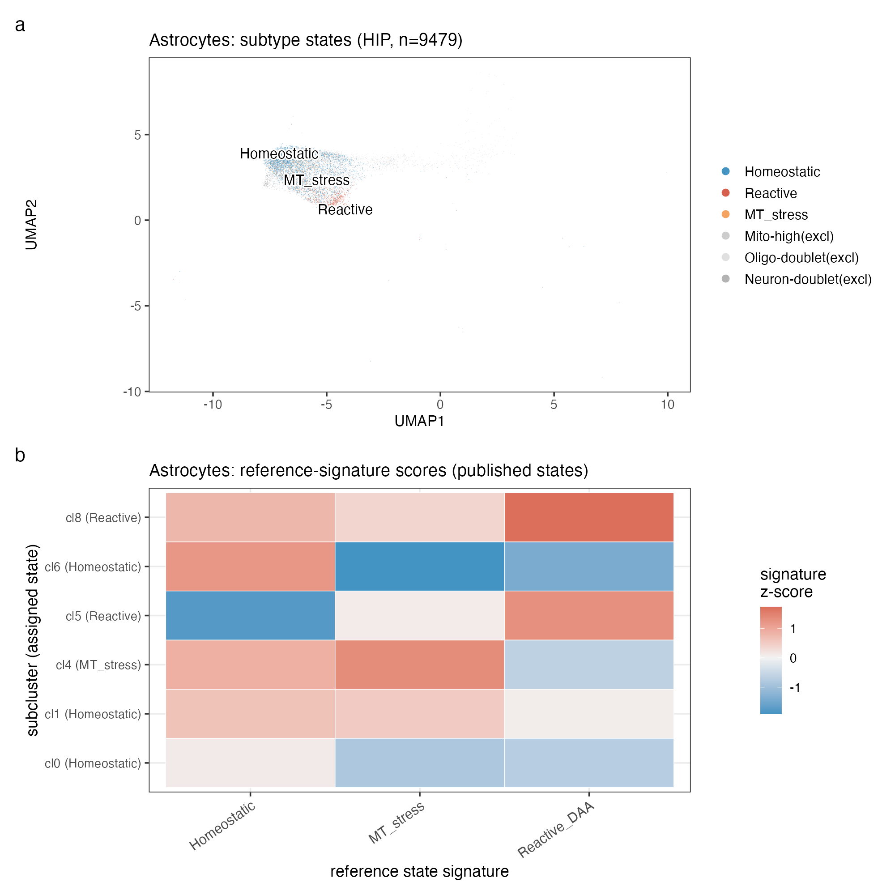
*Figure 12. HIP astrocytes — (a) subtype-state UMAP; (b) reference-signature z-scores per subcluster (homeostatic, reactive/DAA, metallothionein-stress).*

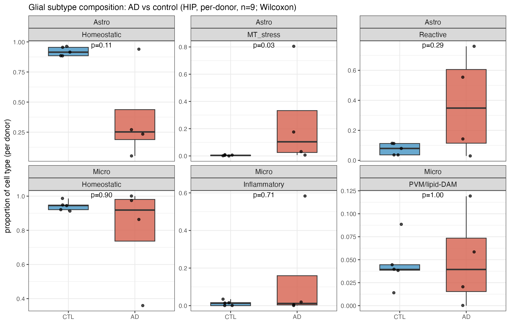
*Figure 13. Per-donor glial subtype proportions, AD vs control (HIP, n=9, Wilcoxon). Metallothionein-stress astrocytes are significantly expanded in AD (p=0.03); other reactive/activated states trend up without reaching significance.*

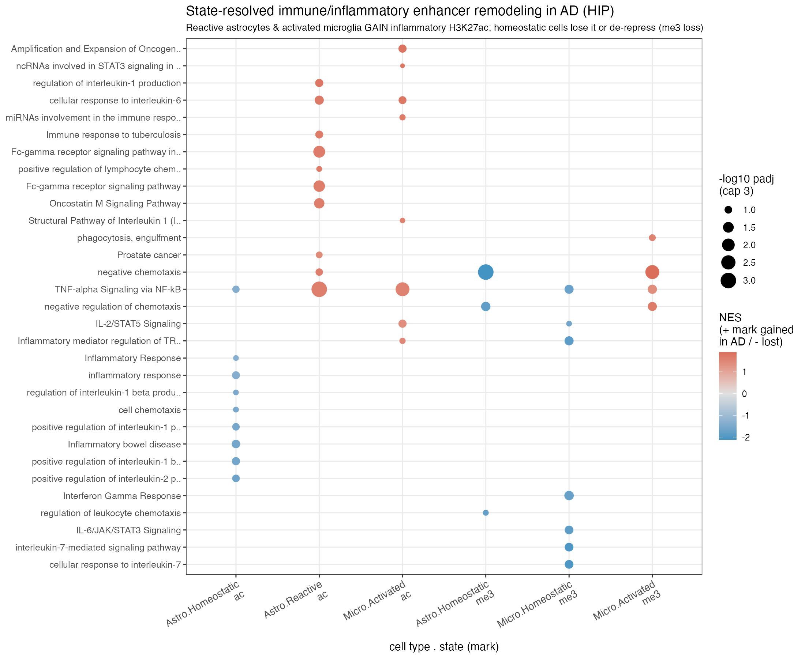
*Figure 14. State-resolved immune/inflammatory enhancer direction in AD (HIP). Reactive astrocytes and activated microglia gain inflammatory H3K27ac (red); homeostatic astrocytes lose it and homeostatic microglia lose the repressive H3K27me3 mark (de-repression). Dot size = −log10 padj, colour = NES.*

## 5. Prioritized validation targets (Deliverable 5)
Targets were ranked per region × cell-type context (`csv/prioritized_targets_by_context.csv`) and as a focused CBL-microglia immune list (`csv/prioritized_validation_targets.csv`), by AD effect × CRE–gene link strength × AD-GWAS weight, and are summarized as a multi-layer heatmap crossing signed CRE log2FC, gene log2FC, pathway membership, link strength and AD-GWAS status (**Figure 15**). Each target names a **specific CRE to test**. Examples: CD86 (chr3-122073933-122075566, rho 0.57), IL6 (AD-GWAS, chr7-22720724-22722103), PTGS2, TNFAIP3 (AD-GWAS, chr6-137864970-137868253) in cerebellar microglia; APOE in cerebellar granule neurons (concordant CRE + gene loss); TYROBP, PTK2B and ABCA7 in HIP oligodendrocytes; CR1 in HIP inhibitory neurons; CD33 in HIP microglia; and the CHI3L1/CCL2/TLR4 NF-κB program in HIP astrocytes.

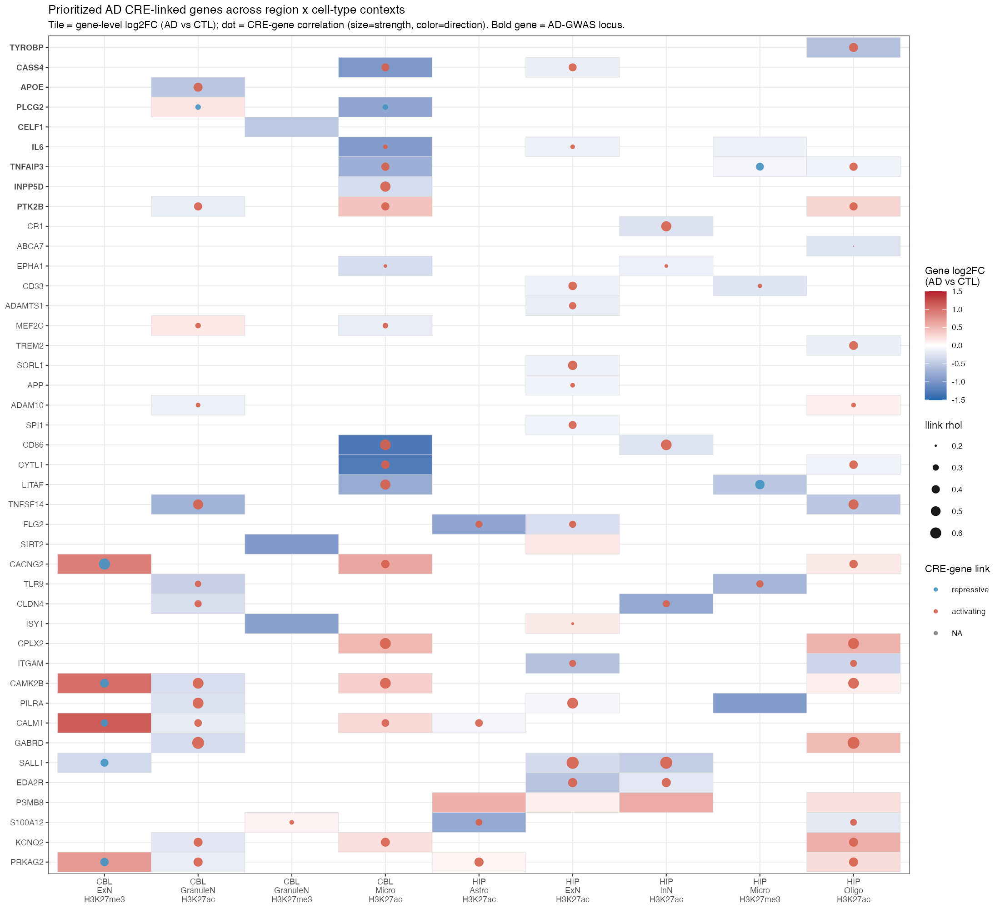
*Figure 15. Prioritized AD-risk / CRE-linked genes across region × cell-type contexts: tile = gene log2FC; dot = CRE–gene link (size = |rho|, colour = activating/repressive); bold = AD-GWAS gene.*

For the two glial cell types carrying the state-resolved immune signal, targets are additionally shown per cell type with their subtype-state enhancer context (**Figures 16–17**): each figure combines the prioritized CRE-linked target genes for that cell type (panel a) with the state-resolved immune-enhancer direction (panel b), so a candidate gene can be read together with the glial state in which its program is remodeled.

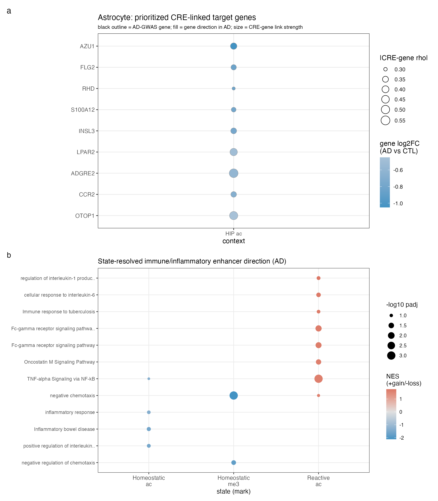
*Figure 16. Astrocyte — (a) prioritized CRE-linked target genes by context (fill = gene log2FC, size = CRE–gene link strength, black outline = AD-GWAS gene); (b) state-resolved immune/inflammatory enhancer direction, showing the reactive-state H3K27ac gain against homeostatic loss.*

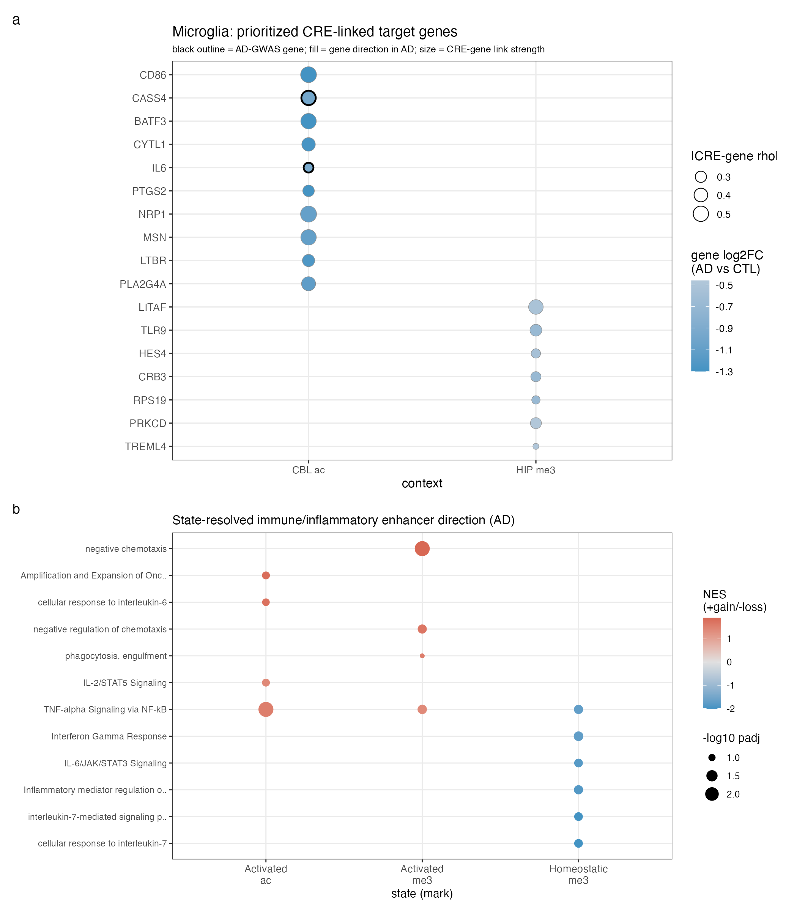
*Figure 17. Microglia — (a) prioritized CRE-linked target genes (CD86, IL6, PTGS2, PLA2G4A, CASS4, TREML4, TLR9, LTBR); (b) state-resolved direction: activated-microglial H3K27ac gain and homeostatic-microglial H3K27me3 loss (de-repression) at immune programs.*

## 6. Discussion

**A distributed, cell-type-specific epigenomic signature rather than a few large hits.** The central result of this study — a near-null single-element differential landscape that nonetheless yields 431 coherent pathway-level enrichments — is the expected signature of a modestly powered, biologically real effect. This mirrors the trajectory of single-cell AD transcriptomics, where disease-associated changes are cell-type-specific and often subtle at the individual-gene level but robust when aggregated into cellular states and programs ([Mathys 2019]; [Mathys 2023]). Interpreting the pooled signal as the primary finding, while reporting the single-element result honestly, is therefore the statistically appropriate reading of these data, not a rescue of a negative result.

**Convergence on neuroimmune regulation aligns with AD's genetic architecture.** The strongest and most internally consistent axis of remodeling touches microglial and astrocytic immune programs and, within them, AD-GWAS loci (TREM2, TYROBP, INPP5D, PLCG2, SPI1, CD33, APOE). This is precisely the compartment where common AD risk variants are concentrated: brain cell-type enhancer maps and myeloid genomic integration have shown that AD heritability is enriched in microglial/myeloid enhancers rather than neuronal ones ([Nott 2019]; [Novikova 2021]). Our observation that immune-enhancer marking is the dominant axis of AD-associated CRE change is consistent with the hypothesis that genetic risk acts through microglial gene-regulatory dysfunction, and it extends that model from static enhancer annotation to *disease-associated remodeling* of those same elements.

**The TYROBP/DAP12 network is a recurring node.** Reduced H3K27ac over the TYROBP/DAP12 module in cerebellar microglia, and TYROBP among the HIP-oligodendrocyte targets, is notable because TYROBP/DAP12 is the core signaling partner of TREM2 and a hub of the "disease-associated microglia" (DAM) activation program ([Deczkowska 2018]; [Podleśny-Drabiniok 2020]). Both loss- and gain-of-function perturbations of TYROBP reshape microglial and amyloid phenotypes in AD models ([Haure-Mirande 2018]; [Audrain 2020]), so an AD-associated shift in the active-enhancer marking of this network is mechanistically plausible and directly testable.

**A glial-state reframing: the AD signal is a chromatin-level reactive switch, not a proportion shift.** The state-resolved analysis (§4.7) is the biological core of this study and reorganizes the interpretation around glial *reaction* rather than cell-type averages. In hippocampus, the astrocyte inflammatory-enhancer gain resolves into a clean **state-switch**: homeostatic astrocytes *lose* H3K27ac at TNF-α/NF-κB, IL-1 and IL-6 programs while reactive astrocytes *gain* it (led by CHI3L1/CXCL2/CCL2). NF-κB is a central driver of neuroinflammatory transcription in AD ([Sun 2022]), and CHI3L1/YKL-40 is an established astrocyte-derived CSF biomarker of neuroinflammation ([Lananna 2020]); seeing the program partitioned by astrocyte state — activated in the reactive compartment, withdrawn from the homeostatic one — is the expected epigenomic correlate of reactive astrogliosis and matches the disease-associated-astrocyte (DAA) concept ([Habib 2020]). Microglia show the complementary chromatin logic: the activated state gains immune H3K27ac, while homeostatic microglia *lose the repressive H3K27me3 mark* at immune loci (IFN-γ, TNF-α, IL-6/JAK/STAT3, IL-7) — a **de-repression/priming** signature consistent with the DAM/ROSMAP microglial-activation trajectory ([Keren-Shaul 2017]; [Sun 2023]). What is largely *expected* is the identity of the states and their marker programs; what is *novel* here is the direct histone-level readout — active-mark gain in reactive cells set against active-mark loss / repressive-mark loss in homeostatic cells within the same tissue. Proportion shifts point the same way but are mostly underpowered at n=9 (only metallothionein-stress astrocytes reach significance, p=0.03), so the reactive signal lives primarily in the enhancer landscape of the reactive/activated states rather than in gross expansion of those states — nominating state-specific enhancers (CHI3L1, CCL2, TLR-axis in reactive astrocytes; the TNF/IL-2/IL-6 module in activated microglia) for follow-up.

**Why hippocampus and cerebellum diverge.** The two regions' glia move their shared immune programs in *opposite* directions: hippocampal (reactive) astrocytes gain inflammatory H3K27ac, whereas cerebellar microglia broadly lose it. A parsimonious reading is that the AD-vulnerable hippocampus mounts a full reactive-glial response — astrocyte activation and microglial priming — while the relatively spared cerebellum shows immune *dampening* or a failure to engage that response. This regional split is consistent with the selective vulnerability of the hippocampal formation and the cerebellum's classical relative sparing, and it reframes the earlier "burden count" (largest in cerebellar microglia) as a matter of *direction*, not magnitude of pathology.

**The cerebellar-microglia signal warrants caution.** That the single largest remodeling burden falls in cerebellar microglia is unexpected, because the cerebellum is classically considered relatively spared in AD. Two readings are possible and not mutually exclusive: a genuine region-specific immune dampening/altered responsiveness in a compartment that does not mount the full reactive response seen in vulnerable regions; or a partly technical effect amplified by small microglial strata and the immune bias of the available gene-set collections. Spatial-epigenomic work is beginning to report altered glial chromatin regulation in AD across regions ([Kong 2025]), but the direction and regional specificity we observe should be treated as a strong hypothesis pending replication in a larger cerebellar sample. We deliberately framed this axis as dampening rather than silencing throughout.

**Methodological contribution.** Joint single-nucleus profiling of a histone mark and the transcriptome ([Zhu 2021]; [Xie 2023]) let us link CRE state to expression *within* cell types without cross-assay deconvolution; the recovered activating-H3K27ac / repressive-H3K27me3 correlation signatures confirm the linkage is measuring real regulation. Building a consensus peak set and re-quantifying all libraries against it — rather than trusting non-comparable per-library MACS2 calls — was essential to make donors comparable, and donor-level pseudobulk with an unadjusted diagnosis-only model was the defensible choice given near-complete batch–diagnosis confounding.

## 7. Limitations
- **Statistical power.** 8–9 donors/arm; single-CRE DE is near-null and all pathway-level findings are pooled and hypothesis-generating. The CBL-H3K27me3 arm (n=8, 3 AD) is the weakest.
- **Batch–diagnosis confounding.** Sequencing library is near-confounded with diagnosis; we used an unadjusted diagnosis-only model and explicitly discarded batch-driven hits, but residual confounding cannot be excluded.
- **Gene-set bias.** Enrichment used Enrichr GMTs (org.Hs.eg.db/MSigDB were not installable in this environment); these collections are immune/blood-biased, which can inflate the prominence of immune themes.
- **Cerebellum-specific microglial signal** is biologically unusual and rests on small microglial strata — a strong hypothesis, not a settled result.
- **No H3K4 marks**, so "dual" states are population-level and true poised/bivalent chromatin cannot be resolved.
- **Cross-sectional, post-mortem** design; all associations are correlational, not causal.

## 8. Future work
Validate top CRE–gene targets (e.g. CD86, IL6, TNFAIP3 microglial enhancers; CHI3L1/CCL2/TLR4 astrocyte enhancers; the TYROBP network) by orthogonal assay in an independent, larger cohort; test the cerebellar-microglia dampening against a larger cerebellar sample and against an alternative, unbiased gene-set collection; extend the state-resolved subtype analysis to cerebellar astrocytes and oligodendrocytes (data-supportable, deferred here) and to a cohort large enough to power per-state single-CRE tests (the state split reduces per-group donor counts and single-CRE DE remained near-null); add H3K4me1/3 to resolve genuine poised/bivalent states; and integrate spatial context and orthogonal AD-GWAS/eQTL fine-mapping to strengthen causal prioritization.

## 9. References
1. [Zhu 2021] Zhu C, et al. Joint profiling of histone modifications and transcriptome in single cells. *Nat Methods*. 2021. doi:10.1038/s41592-021-01060-3
2. [Xie 2023] Xie Y, et al. Droplet-based single-cell joint profiling of histone modifications and transcriptomes. *Nat Struct Mol Biol*. 2023. doi:10.1038/s41594-023-01060-1
3. [Stuart 2021] Stuart T, et al. Single-cell chromatin state analysis with Signac. *Nat Methods*. 2021. doi:10.1038/s41592-021-01282-5
4. [Korsunsky 2019] Korsunsky I, et al. Fast, sensitive and accurate integration of single-cell data with Harmony. *Nat Methods*. 2019. doi:10.1038/s41592-019-0619-0
5. [Zhang 2008] Zhang Y, et al. Model-based analysis of ChIP-Seq (MACS). *Genome Biol*. 2008. doi:10.1186/gb-2008-9-9-r137
6. [Robinson 2010] Robinson MD, et al. edgeR: differential expression analysis of digital gene expression data. *Bioinformatics*. 2010. doi:10.1093/bioinformatics/btp616
7. [Subramanian 2005] Subramanian A, et al. Gene set enrichment analysis. *Proc Natl Acad Sci USA*. 2005. doi:10.1073/pnas.0506580102
8. [Thurman 2021] Thurman AL, et al. Differential gene expression analysis for multi-subject single-cell studies (aggregateBioVar). *Bioinformatics*. 2021. doi:10.1093/bioinformatics/btab337
9. [Mathys 2019] Mathys H, et al. Single-cell transcriptomic analysis of Alzheimer's disease. *Nature*. 2019. doi:10.1038/s41586-019-1195-2
10. [Mathys 2023] Mathys H, et al. Single-cell atlas reveals correlates of high cognitive function in AD. *Cell*. 2023. doi:10.1016/j.cell.2023.08.039
11. [Nott 2019] Nott A, et al. Brain cell type-specific enhancer-promoter interactome maps and disease-risk association. *Science*. 2019. PMID:31727856. doi:10.1126/science.aay0793
12. [Novikova 2021] Novikova G, et al. Integration of Alzheimer's disease genetics and myeloid genomics identifies disease-risk regulatory elements. *Nat Commun*. 2021. doi:10.1038/s41467-021-21823-y
13. [Deczkowska 2018] Deczkowska A, et al. Disease-Associated Microglia: A Universal Immune Sensor of Neurodegeneration. *Cell*. 2018. doi:10.1016/j.cell.2018.05.003
14. [Podleśny-Drabiniok 2020] Podleśny-Drabiniok A, et al. Microglial Phagocytosis: A Disease-Associated Process Emerging from AD Genetics. *Trends Neurosci*. 2020. doi:10.1016/j.tins.2020.10.002
15. [Haure-Mirande 2018] Haure-Mirande JV, et al. Integrative approach to sporadic Alzheimer's disease: deficiency of TYROBP/DAP12. *Mol Psychiatry*. 2018. doi:10.1038/s41380-018-0255-6
16. [Audrain 2020] Audrain M, et al. Reactive or transgenic increase in microglial TYROBP reveals a TREM2-independent TYROBP–APOE link. *Alzheimers Dement*. 2020. doi:10.1002/alz.12256
17. [Sun 2022] Sun E, et al. The Pivotal Role of NF-κB in the Pathogenesis and Therapeutics of Alzheimer's disease. *Int J Mol Sci*. 2022. doi:10.3390/ijms23168972
18. [Lananna 2020] Lananna BV, et al. Chi3l1/YKL-40 is controlled by the astrocyte circadian clock and regulates neuroinflammation. *Sci Transl Med*. 2020. doi:10.1126/scitranslmed.aax3519
19. [Kong 2025] Kong Y, et al. Spatial profiling of chromatin accessibility reveals alteration of glial regulation in Alzheimer's disease. *bioRxiv*. 2025. doi:10.1101/2025.05.01.651759
20. [Keren-Shaul 2017] Keren-Shaul H, et al. A Unique Microglia Type Associated with Restricting Development of Alzheimer's Disease. *Cell*. 2017;169(7):1276-1290.e17. doi:10.1016/j.cell.2017.05.018
21. [Sun 2023] Sun N, et al. Human microglial state dynamics in Alzheimer's disease progression. *Cell*. 2023;186(20):4386-4403.e29. doi:10.1016/j.cell.2023.08.037
22. [Habib 2020] Habib N, et al. Disease-associated astrocytes in Alzheimer's disease and aging. *Nat Neurosci*. 2020;23(6):701-706. doi:10.1038/s41593-020-0624-8

*Reference metadata (titles, journals, years, DOIs/PMIDs) retrieved and verified via PubMed. Software-tool references (1–8) cite the canonical method papers for the versions used.*

## 10. Deliverables (artifacts)
Atlas: `csv/CRE_atlas_H3K27ac.csv.gz`, `csv/CRE_atlas_H3K27me3.csv.gz`, `CRE_atlas_heatmap.png`, `CRE_atlas_context.png`. States: `csv/CRE_regulatory_states.csv.gz`, `CRE_state_classification.png`. Differential: `csv/DE_summary.csv`, `csv/DE_significant_CREs.csv`, `csv/DE_results_suggestive.csv.gz`, `DE_volcanoes.png`, `csv/DE_genelevel_results.csv.gz`, `csv/GSEA_results.csv.gz`, `GSEA_pathways.png`. CRE-gene: `csv/CRE_gene_associations.csv.gz`, `CRE_gene_associations.png`. Interpretation: `celltype_interpretation.png`, `csv/celltype_remodeling_burden.csv`, `csv/celltype_pathway_themes.csv`. Per-cell-type enrichment: `celltype_enrichment_scatter.png`, `csv/celltype_enrichment_scatter.csv`. Targets: `prioritized_targets_heatmap.png`, `prioritized_targets_astrocyte.png`, `prioritized_targets_microglia.png`, `csv/prioritized_targets_by_context.csv`, `csv/prioritized_validation_targets.csv`, `csv/validation_targets_microglia_immune.csv`. Glial subtypes: `glial_subtypes_microglia.png`, `glial_subtypes_astrocyte.png`, `csv/glial_subtype_assignments.csv`, `subtype_composition.png`, `csv/subtype_composition_AD_vs_CTL.csv`, `subtype_immune_enrichment.png`, `csv/subtype_CRE_DE.csv`, `csv/subtype_CRE_DE_summary.csv`, `csv/subtype_CRE_GSEA.csv`. Cell typing: `celltypes_HIP.png`, `celltypes_CBL.png`, `csv/cell_annotations.csv.gz`, `csv/celltype_counts_by_arm.csv`. QC: `qc_metrics.png`, `csv/qc_summary_table.csv`, `csv/qc_donor_composition.csv`, `csv/sample_manifest_corrected.csv`. Records: `NOTEBOOK.md`, `DECISIONS.md`, `AI_STATE.yaml`, plus the plain-English methods document.
